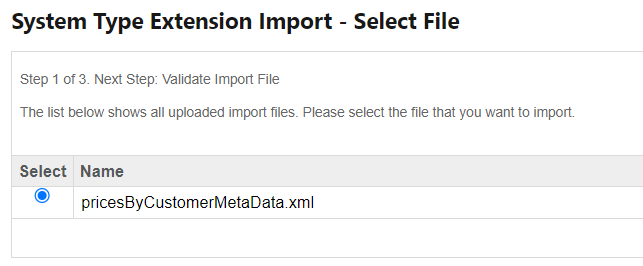
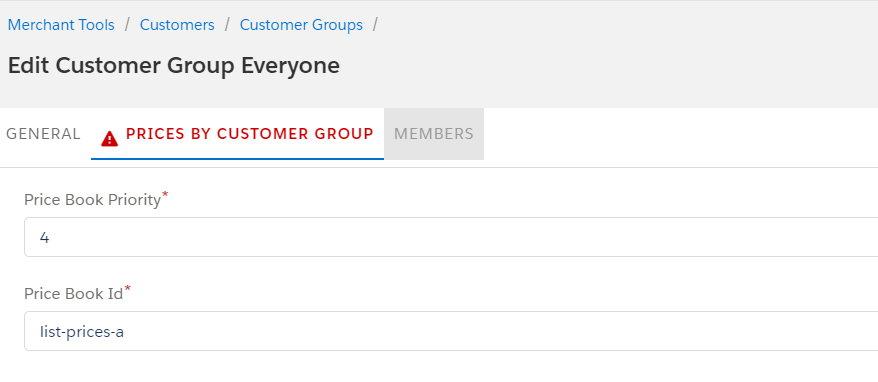
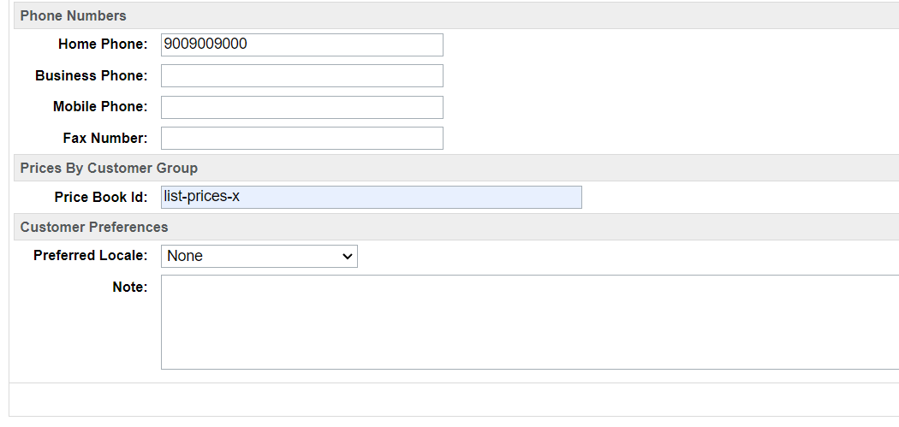

# Salesforce Commerce Cloud (SFCC) Prices by Customer Group for SFRA

**Note:** This repository is a preview of the SFCC Prices by Customer Group. The purpose of this repository is to allow future customers to see the file structure of the package and to access the README and see how the package works and what features provides. It is important to mention that Prices by Customer Group for PWA Kit uses template extensibility so this preview is only meant to show the file structure and the files that were modified when building the package. File structure and files preview for Prices by Customer Group for SFRA is also available. The complete package contains the full structure of both PWA Kit and SFRA code.

The files available in this preview are:

- [PWA _app-config](./sfcc-prices-by-customer-group/app/components/_app-config/index.jsx)
- [PWA app-core](./sfcc-prices-by-customer-group/app/components/app-core/index.jsx)
- [PWA controller-manager.js](./sfcc-prices-by-customer-group/app/utils/controller-manager.js)
- [SFRA pricesByCustomerGroupHook.js](./sfra-codebase/prices_by_customer_group/cartridges/prices_by_customer_group/cartridge/scripts/hooks/pricesByCustomerGroupHook.js)
- [SFRA hooks json](./sfra-codebase/prices_by_customer_group/cartridges/prices_by_customer_group/hooks.json)

Prices by Customer Group for Salesforce Commerce Cloud (SFCC) is a comprehensive package that adds essential functionalities for e-commerce. This plugin allows you to establish and manage prices based on the customer group, which is particularly useful for businesses that want to adjust prices for customers that meet certain requirements.

Moreover, this package can seamlessly integrate with Salesforce Commerce Cloud architectures like Storefront Reference Architecture (SFRA) or PWA Kit | Composable Storefront. This flexibility ensures a customizable implementation, adapting to the specific needs of each e-commerce business.

# Features 

SFCC Prices by Customer Group provides the following features:

- Update prices of the site based on customer groups
- Configure and customize price books and priority for each customer group
- Configure price book for each customer
- Support for price books in different currencies

# Prerequisites

1. The store must be previously configured and functioning correctly under the SFRA or PWA kit Architecture.

2. You must have **Administrator** permissions in the Business Manager (BM), which will allow you to configure the package.

# Installation

### Storefront Reference Architecture (SFRA)

The Prices by Customer Group for Salesforce Commerce Cloud (SFCC) is designed to integrate with Storefront Reference Architecture (SFRA). To install this package, please follow the instructions in the [installation guide for SFRA](./sfra-codebase/prices_by_customer_group/README.md)

### PWA kit

The Prices by Customer Group for Salesforce Commerce Cloud (SFCC) is designed to integrate with PWA Kit. To install this package, please follow the instructions in the [installation guide for PWA Kit](./sfcc-prices-by-customer-group/README.md)

# Set up & Usage

### Set up

Go to the Business Manager (BM) with administrator permissions and proceed to perform the following steps to correctly configure the required package fields:

1. Go to the **Administration** option > **Site Development** column > **Import & Export**
2. Locate the **Import & Export files** section and click the **Upload** option
3. While in the new section choose and upload the provided [XML](./sfra-codebase/prices_by_customer_group/docs/pricesByCustomerMetaData.xml) file
4. After uploading the file, you should be able to see it in the table under the **Manage Import Files** section
5. Return to **Import & Export** column and locate the **Meta Data** section and click on the **Import** option
6. You should see the file uploaded previously in a table under the **System Type Extension Import - Select File** section, select it and then, click the **Next** button

> [!NOTE]
> In case you found any error logs during the import process, we recommend contacting the Appspring Technologies team for assistance and to resolve any.

7. After clicking the **Next** button, proceed by clicking **Import**
8. You can review the import status and/or verify that the fields have been created correctly
9. If the import was successful, you should be able to see the following fields created for the **CustomerGroup** system object:

    - **Price Book Id** field specifications:
        - ID: **priceBookId**
        - Display Name: Price Book Id
        - Value Type: String
        - Mandatory: True
    
    - **Price Book Priority** field specifications:
        - ID: **priceBookPriority**
        - Display Name: Price Book Priority
        - Value Type: Integer
        - Mandatory: True
        - Minimum Value: 1

    - **Prices By Customer Group** group specifications:
        - ID: **pricesByCustomerGroup**

10. If the import was successful, you should be able to see the following fields created for the **Profile** system object:

    - **Price Book Id** field specifications:
        - ID: **priceBookId**
        - Display Name: Price Book Id
        - Value Type: String
        - Mandatory: True

    - **Prices By Customer Group** group specifications:
        - ID: **pricesByCustomerGroup**

11. Since SFCC Prices by Customer Group supports multiple currencies, you need to make sure that you properly set the available currencies in the [countries.json](./sfra-codebase/prices_by_customer_group/cartridges/prices_by_customer_group/cartridge/config/countries.json) file. The package has some currencies configured by default for the *en_US* locale site, however, if you need to support additional currencies, you must add them to this file

### Usage

After correctly creating and grouping the new fields, you can procede to properly to configure data in order to use the package.

SFCC Prices by Customer Group allows the administrator to use the Customer Groups functionality provided by Salesforce Commerce Cloud in order to assign list of prices to customers that are included in this groups. The package extends the Customer Groups functionality by adding the **Prices By Customer Group** tab to the Business Manager, which includes two new fields: *Price Book Priority* and *Price Book Id*. This tab is available for all customer groups, which include *system*, *static* and *dynamic* groups.

You can access the Customer Groups section by going to **Merchant Tools** > **Customers** > **Customer Groups**. In this section you should be seeing the list of all the created groups and if you click on the ID of one of this groups, a view with the detailed information of the group will appear and next to the *General* tab, you will see the *Prices By Customer Group* tab:

The fields in this tab are mandatory, so you must enter values there in order to save the group.

The logic handled by the package is simple, the customer group will have price book priority which is an integer number and a price book list associated by the price book ID. When a customer enters the site, the package will search for the groups associated to this customer and will decide which price book list will be applied depending on the price book priority; the higher the number, the lower the priority. For example, if the **customer group A** has a priority of 5 and the **customer group B** has a priority value of 3, the group with the highest priority in this case would be **customer group B**. The highest possible priority value for a customer group would be equal to 1 and the package will **always** select the first customer group that finds with the highest priority, so keep that in mind when assigning priority to a customer group.

There is an extra logic when it comes to **registered** customers, because the package allows to assign a price book to a specific customer profile, giving the option to customize prices on the customer level. In order to configure this, go to **Merchant Tools** > **Customers** > **Customers** and search for the customer you want to modify. When you enter the profile, you should see the information of the customer and in that form, there is a section called **Prices By Customer Group** that contains the **Price Book Id** field in which you can assign the price book to the customer. If a price book ID is set for a registered customer, the package will ignore the customer groups and will choose the customer price book ID as the one with the highest priority.

SFCC Prices by Customer Group also supports multiple currencies, so you can assign a price book list with a different currency to a group or to the customer. When doing this, make sure that the currency is enabled in **Merchant Tools** > **Site Preferences** > **Currencies** and in case is not, enable it or the prices will not be properly displayed. For SFRA, you need to enable the currencies for the locale in the *countries.json* file (check [Setup](#set-up) section, step 11). Keep in mind to properly assign taxes and shipping methods for the currency of the price book or you will have issues with cart and checkout.

Finally, make sure that the price book lists you create have prices for all products or else, some products will not be properly displayed in the site.

